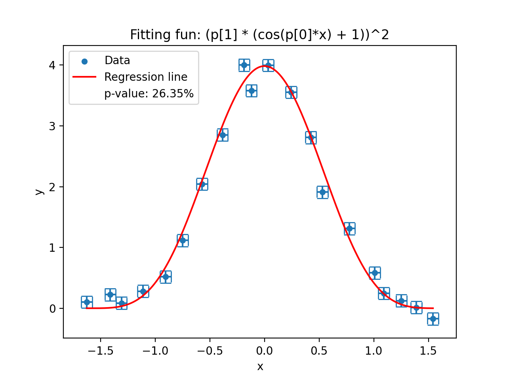

# Guidelines to the Cosmic Radiation lab report

## Common mistakes to be avoided

- "Earth" means the planet and "earth" means ground.
- In scientific reports, usages of pronouns like "we", "our" or "us" should be avoided.
- Citations should be placed at the end of each sentence before the period (see [here](https://academia.stackexchange.com/questions/85477/where-should-citations-be-placed-relative-to-punctuation-e-g-full-stops-and-c)). DO NOT put all citations at the end of a paragraph.
- Each plot must have a x-axis label, a y-axis label and a subtitle. Each label must also contain a unit. In case of histograms, the unit of the y-axis label (counts) should be `per ${Bin_Width}` or `/${Bin_Width}`.  
    Example:
    <p align="center">
    
    </p>
- Any picture in the report must be referred to somewhere in the text.
- The font size in pictures should be roughly the same as in the text.
- Make sure errors are correctly evaluated. Please look at the section [Error evaluation](#error-evaluation) below.
- Every parameter fitting needs to be reported with a p-value (a.k.a confidence level). Please look at the section [Goodness of fit](#goodness-of-fit) below.
- **There is no Na-22 source used in this experiment.**
- **There is no gate generator used in this experiment.**
- The style of figure captions should be consistent, such as the first letter captalization and period at the end of sentence. 

## Important suggestions
- Before submitting the report, please go through it together with your group members. Check whether there are typos or whether each sentence ends with a period, etc. Since it's quite normal for each group member to have different writing skills, reading the report together is a great opportunity to learn from each other about how to write sentences in a clear and comprehensive way.

- Make sure all aspects of the experiment are covered in the report, while also keeping it short and compact. The suggested length of the report is 15 to 20 pages (including the reference list at the end).

## Recommended structure of the lab report

**ATTENTION**: The following structure of chapters and chapter names are merely a suggestion. The points under each chapter are aspects that should be covered. Feel free to add your own ideas.

### Chapter 1: Introduction
Some general information about this experiment should be written here **very briefly**, such as what this experiment is about and what kind of measurements are done.

### Chapter 2: Theoretical Background

- History of the discovery of cosmic radiation (**briefly**)
- Different components of cosmic radiation (**detailed**)
- What could be the possible angular distribution of muons (**briefly**)
- East-west effect
- Properties of muons  
    *Keywords*: lepton, mass, lifetime, energy loss, Bethe-Bloch formula, minimum ionizing particle

### Chapter 3: Detectors and Electronic Modules

- Scintillation (plastic) and its principle (**very detailed**)  
    Please look at chapter 8, section 1 of [Radiation Detection and Measurement](https://phyusdb.files.wordpress.com/2013/03/radiationdetectionandmeasurementbyknoll.pdf).
- PMT and its principle
- Mechanism behind a constant-fraction discriminator (**detailed**)
    * What are the functions of a CFD and why are CFDs needed in this experiment?  
      *HINT*: the time-walk effect and background noise
    * What are the outputs of a CFD?  
      *HINT*: the logical output and constant-fraction shaped signals, the one with zero-crossing
- Logical unit
- Delay module
- Time-amplitude converter (TAC)
- Multi-channel analyser (MCA)

### Chapter 4: Experimental Procedures and Setups
- Setup for scintillators  
    *Keywords*: rotatable frames, distance between two bars
- Setup for CFDs
    * How to determine the time delay for the CFD?
    * How to determine an optimal value for the threshold of the CFDs? 
    * What is the width of the logical output of the CFD?
- Coincidence verification  
     How to make sure there is no extra time delay difference introduced by cables?  
    *Keywords*: cable length, T-piece
- Setup and cable connections for the muon angular distribution measurement (**detailed**)
    * Modules and cable connections
    * How to count the muons coming from a specific zenith angle?
- Setup for the muon velocity measurement (**detailed**)
    * Modules and cable connections
    * How to measure the muon velocity?
    * How to determine the correlation between the channel number and the real time value?
    * Why is a manual delay needed?
    * How to eliminate the intrinsic unknown time delay in the modules?

### Chapter 5: Results and Analysis
- Determination of the CFD threshold
- Results of the muon angular distribution measurement  
    * What is the fitting function for the angular distribution?
- East-west coefficient
- Results of the muon velocity measurement
    * Spectrum of time differences
    * Explanation of the tail at larger time values
    * Fitting function and calculation for the crossing time of perpendicularly traveling muons?
    * Calculation of the muon velocity

### Chapter 6: Discussion
A very brief restatement of what has been done in this experiment and the relevant results. If the calculated muon velocity is larger than the speed of light, what could be contributing factors of this error?

## Error evaluation
### Gaussian error propagation
To calculate the error of an evaluated value, which is depending on other variables (with known errors), use the [Gaussian error propagation](https://www.statisticshowto.com/statistics-basics/error-propagation/):  

$$\begin{align}
\text{if} &&\\
&& y &= f(x_1, x_2, ..., x_n)&\\
\text{then} &&\\
&&\delta y &= \sqrt{\sum_{i}^{n}\left(\frac{\partial y}{\partial x_i}\right)^2{\delta x_i}^2}
\end{align}$$

**ATTENTION**: All variables $x_1, x_2, x_3, ..., x_n$ in this equation must be [independent](https://en.wikipedia.org/wiki/Independence_\(probability_theory\)) of each other.  
Example:

$$\begin{align} \text{if}&&\\
&&y &= x_1 + x_2 \\
\text{then}&&\\
&&\delta y &= \sqrt{\left(\delta x_1\right)^2 + \left(\delta x_2\right)^2}\\
&& &\neq \delta x_1 + \delta x_2 \end{align}$$

### Linear regression
In this experiment, linear regression is required to obtain the relation between the channel number and the real time value. It's recommended to use Python (scipy) to calculate relevant coefficients and their corresponding errors. 

#### Algorithm
An examples is shown below (see [source file](data_fitting.py) for full detail):
```python
model = odr.Model(fcn = lambda p,x : p[0]* x + p[1])
data = odr.RealData(x = dataframe['x'], y = dataframe['y'], 
                    sx = dataframe['x_err'], sy = dataframe['y_err'])
ODR_reg = odr.ODR(data, model, beta0 = [1., 0.])
res = ODR_reg.run()
res.pprint()
```
The following plot also shows the [input data](data.csv) and the fitted linear function $y = a \cdot x + b$:
<p align="center">

</p>

The algorithm used here is called [Orthogonal Distance Regression](https://docs.scipy.org/doc/scipy/reference/odr.html) (ODR). The advantage of using ODR is that both values and errors are taken into account during the fitting process, which is often needed in physics experiments, where measured values are always accompanied with **uncertainties**.

The result of the ODR algorithm is:
```text
Beta: [2.09832899 9.19433546]
Beta Std Error: [0.13022205 1.75706129]
Beta Covariance: [[ 0.03170357 -0.38321601]
 [-0.38321601  5.77182231]]
Residual Variance: 0.5348855538422207
Inverse Condition #: 0.0032822996436673783
Reason(s) for Halting:
  Sum of squares convergence
```
The two values after `Beta` are the fitted values for the parameter $a$ and $b$. `Beta Covariance` is the (co)variance matrix of the fitting parameters, defined as:

$$ Var(a, b) = \begin{bmatrix} \delta\^2_a & \delta\^2_{ab} \\\\ 
\delta\^2\_{ab} & \delta\^2\_{b} \end{bmatrix}$$

where $\delta^2_{ab}$ is the covariance of $a$ and $b$. Be aware that the numbers in `Beta Std Error` are scaled standard deviation, which are calculated to be the square root of the products between variance and residual variance. The last important value of the result is `Residual Variance`, also called "reduced $\chi^2$ value", which can be used to calculate the [confidence level](https://www.statista.com/statistics-glossary/definition/328/confidence_level/) (see the last [section](#goodness-of-fit)).

#### Prediction error
Once the calibration relation is determined by linear regression, a prediction of a real time value needs to be made with a channel number (including an error). Since every single value in a physics experiment must have an error (uncertainty), the error of the predicted time value also needs to be determined.

The following shows the mathematical derivation of the prediction error:

First, let the capitalized letter be denoted as a random variable. Thus, the linear relation can be expressed as:

$$ Y = A \cdot X + B$$

Mathematically, the error of a measurement can be viewed as the standard deviation of its random variable, which is the square root of its variance:

$$ \delta_{a} = \sqrt{Var(A)}$$

In probability theory, three properties can be proven very easily:

1. The variance of the sum of two random variables is:
    $$Var(X + Y) = Var(X) + Var(Y) + 2Cov(X, Y)$$
2. The variance of the product of two independent random variables is:
    $$Var(XY) = Var(X)\cdot Var(Y) + Var(X)\cdot E^2(Y) + Var(Y)\cdot E^2(X)$$
3. If $X$ is independent of $Y$ and $Z$, then
    $$Cov(XY, Z) = E(X) \cdot Cov(X, Y)$$

Therefore, the variance of $Y$ can be derived as:

$$\begin{align}
    Var(Y) =& Var(AX + B) \\
    =& Var(AX) + Var(B) + 2Cov(AX, B)\\
    =& Var(A)\cdot Var(X) + Var(A)\cdot E^2(X) + Var(X)\cdot E^2(A) \\
    & + Var(B) + 2E(X)\cdot Cov(A, B)
\end{align}$$

Please keep in mind that $X$ is the input, which is independent of the coefficients $A$ and $B$.

Therefore the prediction variance can be expressed as:

$$\delta^2_y =  \delta^2_a \delta^2_x + \delta^2_b + x^2\delta^2_a + a^2\delta^2_x + 2x\delta^2_{ab}$$

where $\delta_a$, $\delta_b$ and $\delta_x$ are the errors of $a$, $b$ and $x$ respectively. The covariance $\delta^2_{ab}$, as is mentioned above, can be obtained directly from the fitting algorithm.

In the end, the **prediction error** is:

$$\delta_y =  \sqrt{\delta^2_a \delta^2_x + \delta^2_b + x^2\delta^2_a + a^2\delta^2_x + 2x\delta^2_{ab}}$$

For the example above, suppose a prediction needs to be made at $x = 18.5$ with its error $\delta_x = 2.5$. By the result of the ODR algorithm, the fitting parameters of

$$ y = a\cdot x + b$$

are evaluated as $a = 2.10$, $b = 9.19$, $\delta_a = 0.13$ and $\delta_b = 1.75$, with the covariance $\delta^2_{ab} = -0.38$. 
Then, the prediction with its error could be:

$$\begin{align} 
y &= a \cdot x + b \\
&= 2.1 \times 18.5 + 9.19 \\
&= 48.04 \\
\delta_y &= \sqrt{\delta^2_a \delta^2_x + \delta^2_b + x^2\delta^2_a + a^2\delta^2_x + 2x\delta^2_{ab}} \\
&= \sqrt{(0.13)^2 \times (2.5)^2 + (1.75)^2+ (18.5)^2 \times (0.13)^2+ (2.1)^2 \times (2.5)^2 + 2 \times 18.5 \times (-0.38)} \\
&= 4.74
\end{align}$$

## Goodness of fit
The [goodness of fit](https://en.wikipedia.org/wiki/Goodness_of_fit) is measured by the [p-value](https://en.wikipedia.org/wiki/P-value) during a statistical test. In such a test, the **null hypothesis** can usually be defined as:

$$H_0: \text{The underlying function of the measured data is the function used in the fitting process.}$$

If the p-value is less than 5% (0.05), the null hypothesis must be rejected.

The p-value is related to the residual variance (`res_var`) given by the ODR algorithm, through an equation:

$$\text{p-value} = 1 - \text{CDF}(\text{res\\_var}, 1) $$

where `CDF` is the cumulative distribution function of a $\chi^2$ distribution with the degree of freedom equal to 1.

In Python, the p-value can be calculated as:
```python
from scipy import odr, stats

odr_reg = odr.ODR(data, model, beta0 = inits)
odr_reg.run()
res_var = odr_reg.output.__getattribute__('res_var')
p_value = 1 - stats.chi2.cdf(res_var, df = 1)
```

The following two plots show another example of fitting parameters using the data generated by a cosine function:
<p align="middle">
  
   
</p>
The plot on the left side, using the correct fitting function, obtains a p-value of 26.35%. On the other hand, if the fitting function is chosen incorrectly, as is shown in the plot at the right side, the resulting p-value is very small (< 5%).
