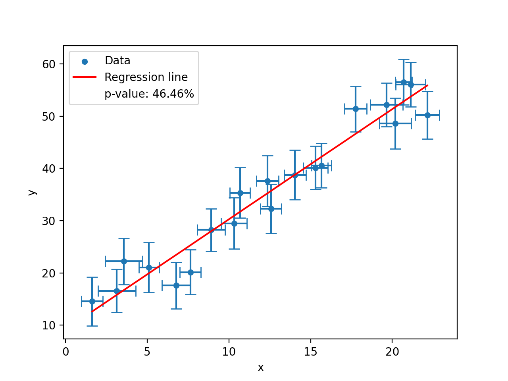

# Guidelines to the Cosmic Radiation lab report


## Common mistakes to be avoided

- "Earth" means the planet and "earth" means ground.
- In scientific reports, usages of pronouns, like "we", "our" or "us" should be avoided.
- Citations should be placed at the end of each sentence before the period (see [this](https://academia.stackexchange.com/questions/85477/where-should-citations-be-placed-relative-to-punctuation-e-g-full-stops-and-c)). DO NOT put all citations at the end of the paragraph.
- Each plot must have a x-axis and y-axis label. Each label must also contain a unit. In case of histograms, the unit of the y-axis label (counts) should be `per ${Bin_Width}` or `/${Bin_Width}`.
- Any picture in the report must be referred to somewhere in the text.
- The font size in pictures should be roughly the same as in the text.
- For the evaluation of errors, please see the section [Error evaluation](#error-evaluation) below.

## Important suggestions
- Before submitting the report, please go through it together with your group members. Check whether there are typos or whether each sentence ends with a period, etc. Since it's quite normal for each group member to have a different writing skill, reading the report together is a great opportunity to learn from each other about how to write sentences in a clear and comprehensive way.

- Make sure all aspects of the experiment are covered in the report, while also keeping it short and compact. The suggested length of the report is 15 to 20 pages (including the reference list at the end).

## Recommended structure of the lab report

**ATTENTION**: The following structure of chapters and chapter names are merely a suggestion. The points under each chapter are aspects that should be covered. Feel free to add your own ideas.

### Chapter 1: Introduction
Some general information about this experiment should be written here **very briefly**, such as what this experiment is about and what kind of measurements are done.

### Chapter 2: Theoretical Background

- History of the discovery of cosmic radiation (**briefly**)
- Different components of cosmic radiation (**detailed**)
- What could be the possible angular distribution of muons (**briefly**)
- East-west effect
- Properties of muons  
    *Keywords*: lepton, mass, lifetime, energy loss, Bethe-Bloch formula, minimum ionizing particle

### Chapter 3: Detectors and Electronic Modules

- Scintillation (plastic) and its principle (**very detailed**)  
    Please see chapter 8, section 1 of [Radiation Detection and Measurement](https://phyusdb.files.wordpress.com/2013/03/radiationdetectionandmeasurementbyknoll.pdf).
- PMT and its principle
- Mechanism behind a constant-fraction discriminator (**detailed**)
    * What are the functions of a CFD and why are CFDs needed in this experiment?  
      *HINT*: the time-walk effect and background noise
    * What are the outputs of a CFD?  
      *HINT*: the logical output and constant-fraction shaped signals, the one with zero-crossing
- Logical unit
- Delay module
- Time-amplitude converter (TAC)
- Multi-channel analyser (MCA)

### Chapter 4: Experimental Procedures and Setups
- Setup for scintillators  
    *Keywords*: rotatable frames, distance between two bars
- Setup for CFDs
    * How to determine the time delay for the CFD?
    * How to determine an optimal value for the threshold of the CFDs? 
    * What is the width of the logical output of the CFD?
- Coincidence verification  
     How to make sure there is no extra time delay difference introduced by cables?  
    *Keywords*: cable length, T-piece
- Setup and cable connections for the muon angular distribution measurement (**detailed**)
    * Modules and cable connections
    * How to count the muons coming from a specific zenith angle?
- Setup for the muon velocity measurement (**detailed**)
    * Modules and cable connections
    * How to measure the muon velocity?
    * How to determine the correlation between the channel number and the real time value?
    * Why is a manual delay needed?
    * How to eliminate the intrinsic unknown time delay in the modules?

### Chapter 5: Results and Analysis
- Determination of the CFD threshold
- Results of the muon angular distribution measurement  
    * What is the fitting function for the angular distribution?
- East-west coefficient
- Results of the muon velocity measurement
    * Spectrum of time differences
    * Explanation of the tail at larger time values
    * Fitting function and calculation for the crossing time of perpendicularly traveling muons?
    * Calculation of the muon velocity

### Chapter 6: Discussion
A very brief restatement of what has been done in this experiment and the relevant results. If the calculated muon velocity is larger than the speed of light, what could be contributing factors of this error?

## Error evaluation
### Gaussian error propagation
To calculate the error of an evaluated value which is depending on other variables (with known errors), use [Gaussian error propagation](https://www.statisticshowto.com/statistics-basics/error-propagation/):  

$$\begin{align}
\text{if} &&\\
&& y &= f(x_1, x_2, ..., x_n)&\\
\text{then} &&\\
&&\delta y &= \sqrt{\sum_{i}^{n}\left(\frac{\partial y}{\partial x_i}\right)^2{\delta x_i}^2}
\end{align}$$

**ATTENTION**: all variables in this equation $x_1, x_2, x_3, ..., x_n$ must be [independent](https://en.wikipedia.org/wiki/Independence_\(probability_theory\)) with eath other.  
Examples:

$$\begin{align} \text{if}&&\\
&&y &= x_1 + x_2 \\
\text{then}&&\\
&&\delta y &= \sqrt{\left(\delta x_1\right)^2 + \left(\delta x_2\right)^2}\\
&& &\neq \delta x_1 + \delta x_2 \end{align}$$

### Linear regression
In this experiment, the method of linear regression is required to obtain the relation between the channel number and the real time value. It's suggested to use Python (scipy) to calculate the relevant coefficients and their corresponding errors. 

One of examples is shown below (see the [source file](data_fitting.py) for the full detail):
```python
model = odr.Model(fcn = lambda p,x : p[0]* x + p[1])
data = odr.RealData(x = dataframe['x'], y = dataframe['y'], sx = dataframe['x_err'], sy = dataframe['y_err'])
ODR_reg = odr.ODR(data, model, beta0 = [1., 0.])
res = ODR_reg.run()
res.pprint()
```
The following plot also shows the [input data](data.csv) and the fitted linear function $y = a \cdot x + b$:


The algorithm used here is called [Orthogonal Distance Regression](https://docs.scipy.org/doc/scipy/reference/odr.html)(ODR). The advantage of using ODR is both values and errors are taken into account during the fitting process, which is often needed in physics experiments where measured values are always accompanied with **uncertainties**.

The result from the ODR algorithm is:
```text
Beta: [2.09832899 9.19433546]
Beta Std Error: [0.13022205 1.75706129]
Beta Covariance: [[ 0.03170357 -0.38321601]
 [-0.38321601  5.77182231]]
Residual Variance: 0.5348855538422207
Inverse Condition #: 0.0032822996436673783
Reason(s) for Halting:
  Sum of squares convergence
```
The two values after `Beta` are the fitted values for the parameter $a$ and $b$ while their corresponding errors $\delta_a$ and $\delta_b$ are shown after `Beta Std Error`. `Beta Covariance` is the (co)variance matrix between the fitting parameters, defined as:

$$ Var(a, b) = \begin{bmatrix} \delta\^2_a & \delta\^2_{ab} \\\\ 
\delta\^2\_{ab} & \delta\^2\_{b} \end{bmatrix}$$

where $\delta^2_{ab}$ is the covariance of $a$ and $b$. The last important value from the result is `Residual Variance`, also called "reduced $\chi^2$ value", can be used to calculate the [confidence level](https://www.statista.com/statistics-glossary/definition/328/confidence_level/) (see the last [section](#reporting-on-goodness-of-fitting)).
## Reporting on goodness of fitting

